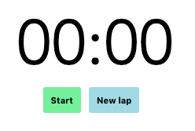
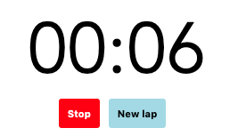

<!-- For syntax highlighting -->
<link rel="stylesheet" href="assets/monokai-sublime.css">


### React + TypeScript*** <!--.element: class="fragment" -->

*** just a little bit <!--.element: class="fragment" -->

---

<div style="float: left; width: 45%;">
  
  <h1 style="font-size: 0.9em;">Martin van Dam</h1>
<small style="display: inline-flex;">Frontend Engineer @ Min. VWS</small>
  <small>@MrtnvDam<br />Martin.van.Dam@ordina.nl</small>
</div>
<div style="float: right; width: 45%;">
  
  <h1 style="font-size: 0.9em;">Michael Awad</h1>
  <small style="display: inline-flex;">Practice Lead & Teamlead @ Min. VWS</small>
   <small>@mikeightyfive<br /> Michael.Awad@ordina.nl</small>
</div>

---

### Expectation management

- Interactive + live coding exercises
- React
- TypeScript (just a little bit)
- TSX
- States, Effects, Props
- Component composition
- Containers vs. Presentational components

---

### ⚠️ Disclaimer

- Hooks instead of classic state 🏴‍☠️
- TSX 💯
- StackBlitz 🚀
- Contains some inline styling 🙀

---

### What are we going to build?

☣️ ➡️ [⏱](https://typescript-react-stopwatch-result.stackblitz.io)

[https://typescript-react-stopwatch-result.stackblitz.io](https://typescript-react-stopwatch-result.stackblitz.io)

---

### ⚠️ But first: What is React?
Anyone?

---

> React is a declarative, efficient, and flexible JavaScript library for building user interfaces. It lets you compose complex UIs from small and isolated pieces of code called “components”.

---

- Alternative for Angular / Vue / etc etc
- Basic and compact
- Scales for bigger applications as well
- Works nicely with State Management solutions (Redux, MobX, GraphQL)

---

### What is a component?

```jsx
const App = () => (
  <div>
    My App
  </div>
)
```

---

### Use your component

```jsx
<App />
```

---

- XML-like syntax
- Like a regular function
- Returns JSX / TSX

---

### What is JSX?

- Syntax extention to JavaScript
- Like a template language, but for client side
- Produces React `Nodes`

---

### Markup + JavaScript

Use regular JavaScript between `{` ... `}`:

```jsx
const myVariable = 'Some value'
const App = () => (
  <div>
    My variable uppercase: {myVariable.toUpperCase()}
  </div>
)
```

---

### Native element properties

```jsx
const App = () => (
  <div 
    style={{ textTransform: 'uppercase' }}
    className="myClassName">
      ...
  </div>
)
```

---

### Native element properties

```jsx
const buttonDisabled = true
const App = () => (
  <input
    type="button"
    value={'Click me!'} // <- both notations can be used
    disabled={buttonDisabled} />
)
```

---

### Styling using CSS stylesheet

Using normal CSS

```jsx
import classes from './styles.css'

const App = () => (
  <div className={classes.myClassName}>
      ...
  </div>
)
```

---

### Styling using inline styles

Using CSS-in-JS

```jsx
const App = () => (
  <div style={{
      fontSize: '18px',
      backgroundColor: 'green'
    }}>
      ...
  </div>
)
```

<small>(not recommended, but easy to start with)</small>

---

### Lets code!

Start your project here! ️

️➡️ https://stackblitz.com/fork/react-ts

OR

️➡️ https://codesandbox.io/s/

---

### Exercise 1

In `App.tsx`:

Create static HTML / JSX elements for:
- Time (mm:hh)
- Start / stop button
<center>
  
</center>

---

### Exercise 1 - Hints


```jsx
<div style={{ backgroundColor: 'blue' }}></div>
<button>My button</button>
```

<center>
  
</center>

---

### Exercise 1 - Result

```jsx
<div>
  <div style={{ fontWeight: 'bold' }}>00:00</div>
  <div>
    <button
      style={{ backgroundColor: 'hotpink' }}>
        Start
    </button>
  </div>
</div>
```

---
### Conditionals

```jsx
const isEnabled = true
const App = () => (
  <div>
    { isEnabled ? 'Enabled' : 'Disabled' }
  </div>
)
```

---

### Iterations

```jsx
const animals = ['cat', 'dog']
const App = () => (
  <div>
      {
        animals.map((animal, index) => (
          <div key={index}>{animal}</div>
        ))
      }
  </div>
)
```

---

### Additional JSX/TSX benefits

- Prevents injection attacks
- Composable using `children`
- You can use TypeScript instead of JavaScript

---

### JSX + TypeScript = TSX

```jsx
const animals: string[] = ['cat', 'dog']
const App = () => (
  <div>
      {
        animals.map((animal: string, index: number) => (
          <div key={index}>{animal}</div>
        ))
      }
  </div>
)
```

---

### Benefits of TSX

- Typesafety inside your views
- Definitions of your `props` and `state`
- No need for `PropTypes`

---

### State

- Store information inside your component
- Useful for forms, loading state and much more

---

### State example 0

```jsx
import { useState } from 'react'

const App: FC = () => {
  const [username, setUsername] = useState('')
  return (
    <div>
      <input
        type={'text'}
        value={username}
        onChange={event => setUsername(event.target.value)}
      />
    </div>
  )
}
```

---

### State example 1

```jsx
import { useState } from 'react'

const App = () => {
  const [isLoading, setIsLoading] = useState(true)

  setTimeout(() => setIsLoading(false), 5000)

  if (isLoading) {
    return <div>Loading...</div>
  }
  return <div>Loading complete!</div>
}
```

---

### State example 2

```jsx
import { useState } from 'react'

const App = () => {
  const [user, setUser] = useState<User | false>(false)

  fetchUser()
    .then((user: User) => setUser(user))

  if (!user) {
    return <div>Loading user...</div>
  }
  return <div>Username: {user.name}</div>
}
```

---

### Exercise 2

Create getters and setters for:

- The seconds passed: `number`
- The stopwatch running state: `boolean`

```ts
const [myState, setMyState] = useState( ... )
```

---

### Exercise 2 - Result

```ts
const [seconds, setSeconds] = useState(0)
const [isRunning, setIsRunning] = useState(false)
```

---

### `useState` getter

```jsx
const App = () => {
  const [buttonDisabled, setButtonDisabled] = useState(false)

  return (
    <button
      disabled={buttonDisabled}>
        Click me!
    </button>
  )
}
```

---

### `useState` setter

```jsx
const App = () => {
  const [buttonDisabled, setButtonDisabled] = useState(false)

  return (
    <button
      onClick={() => setButtonDisabled(true)}
      disabled={buttonDisabled}>
        Click me!
    </button>
  )
}
```

---

### Exercise 3

Use the created getters and setters for:

- When the start/stop button is clicked
- The text of the start/stop button should depend on the state

---

### Exercise 3 - Result

```jsx
<button onClick={() => setIsRunning(!isRunning)}>
  {isRunning ? 'Stop' : 'Start'}
</button>
```

---

### Effects

- Perform side effects
- Use the component lifecycle

---

### On mount

```jsx
import { useEffect } from 'react'

...

useEffect(() => {
  alert('The component is mounted!')
}, [])

...
```

---

### On props / state update

```jsx
...

useEffect(() => {
  alert('The props and/or state has changed!')
})

...
```

(not recommended)
---

### On specific prop / state update

```jsx
...

const [isLoading, setIsLoading] = useState(true)

useEffect(() => {
  alert('The isLoading state has changed!')
}, [isLoading])

...
```

---

### What happens here?

```jsx
let timer = 0

const App = () => {

  useEffect(() => {
    timer = setInterval(() => console.log('tick'), 1000)
  }, [])

  return <div>...</div>
}
```

---

### Exercise 4

When the stopwatch start button is clicked:

- Start the timer and update the `seconds` state every second

Hint: use `setInterval` inside `useEffect` here

---

### Exercise 4 - Example

Start the timer and update the `seconds` state every second

```jsx
let timer = 0 // <-- IMPORTANT!
const App = () => {
  const [timerRunning, setTimerRunning] = useState(false)
  // define your state here...

  useEffect(() => {
    if (timerRunning) {
      timer = setInterval(() => {
        // use your setter here...
      }, 1000)
    }
  }, [timerRunning])
  ...
}
```

---

### Exercise 5

When the stopwatch stop button is clicked:

- Stop the timer
- Make sure that the button text reflects the state

Hint: use `clearInterval` inside the same `useEffect` here

---

### Exercise 5 - Example

When the stopwatch stop button is clicked:

```jsx
let timer = 0
const App = () => {
  ...
  useEffect(() => {
    if (timerRunning) {
      ...
    } else {
      clearInterval(timer)
    }
  }, [timerRunning])
  ...
}
```

---

### Exercise 6

- Covert the seconds in state to minutes and seconds and display it on the screen

Hint: `Math.floor(seconds / 60)` && `seconds % 60`

<center>
  
</center>

---

### Props

Pass information to your components:

```jsx
<App title="App title" />
```

---

Or using a variable:

```jsx
const appTitle = 'App title'

<App title={appTitle} />
```

---

Access Props inside the receiving component:

```jsx
<App title="Hi" />
```

```jsx
const App = props => (
  <div>
    {props.title}
  </div>
)
```

---

### But wait... what is inside my props...?

### I'm missing types here!

---

### Typesafe Props

Define the type of your props:

```ts
type AppProps = {
  title: string
  isloading: boolean
}
```

---

And use inside your component:

```jsx
const App: FC<AppProps> = (props) => (
  <div>
    <div>{props.title}</div>
    <div>{props.username}</div> /* Error! */
  </div>
)
```

`FC === FunctionComponent`

More about this later!

---

### Callback props

```ts
type AppProps = {
  onLogin: () => void
}
```

```jsx
const App: FC<AppProps> = props => (
  <div>
    <button onClick={props.onLogin}>Login!</button>
  </div>
)
```

---

### Define the function and pass through

```jsx
const onLogin = () => {
  // some magic happens
}
```

```jsx
<App onLogin={onLogin} />
```

---

### Typesafe Props

```ts
type AppProps = {
  title: string
}
```

```jsx
<App />
```

What will happen here?

---

```

Type '{}' is not assignable to type 'Readonly<AppProps>'.
  Property 'title' is missing in type '{}'.


```

---

### Children

```jsx
const Page: FC = (props) => (
  <div>
    {props.children}
  </div>
)
```

```jsx
<Page>
  <div>I'm the child!</div>
</Page>
```

---

### Composition example

```jsx
<App>
  <Header>
    <Navigation />
  </Header>
  <Content>
    <SearchForm />
  </Content>
</App>
```

---

### Exercise 7

- Create new file `Button.tsx`
- Create a Button component and put the button code into it
- Import the button component in the main file
- Make it reusable

---

### Exercise 7 - Example

```jsx
// button.ts
type ButtonProps = {
  text: string
  ...
}
export const Button = props => (
  <button>{props.text}</button>
)
```

```js
import { Button } from './button'
```

---

### Exercise 8: Bonus

1. Create a new button to start a new lap
2. When the New lap button is clicked:
  - Add the seconds that are currently in state to the laps state
  - Reset the timer to 0 seconds

Hint: copy the existing array and add a value to it:

```ts
const [seconds, setSeconds] = useState(0);
const [laps, setLaps] = useState<number[]>([]);
setLaps([...laps, seconds])
```

---

### Exercise 9: Bonus

- Show all the laps on the screen

Hint: use `.map()` here.

```jsx
{
  laps.map((lap, index) => (
    <div>...</div>
  ))
}
```

---


### Container vs. Presentational Component

Or: smart vs. dumb

Or fat vs. skinny

Or statefull vs. pure

Or screens vs. components

https://medium.com/@dan_abramov/smart-and-dumb-components-7ca2f9a7c7d0

---

### Container Component

- Fetches data
- Keeps track of state
- Possibly connected to a State Store (Redux / MobX)
- Passes all the data to its children
- Does NOT contain styles

---

### Presentational Component

- Renders UI
- Contains styling
- Easily testable
- As dumb as possible

---

### Possible end result

[➡️ Click](https://stackblitz.com/edit/typescript-react-stopwatch-result)

---

### Function vs. Class

Props

```jsx
const App: FC<Props> = props => <div>{props.title}</div>
```

```jsx
class App extends React.Component<Props> {
  public render() {
    return <div>{this.props.title}</div>
  }
}
```

---

### Function Component

On mount & State

```jsx
const App: FC<Props> = props => {
  const [user, setUser] = useState(false)

  useEffect(() => {
    fetchUser()
      .then(user => setUser(user))
  }, [])
}
```

---

### Class Component

On mount & State

```jsx
class App extends React.Component<Props, State> {
  constructor(props: Props) {
    super(props)
    this.state = {
      user: false
    }
  }

  public async componentDidMount() {
    const user = await fetchUser()
    this.setState({
      user
    })
  }
}
```

---

### React Hooks

- Recommended approach
- Class Components will be removed from the core

---

### Wrap-up

- React + TypeScript
- TSX
- States, Effects, Props
- Component composition
- Containers vs. Presentationals

---

### Resources

- create-react-app
- https://medium.com/@dan_abramov/smart-and-dumb-components-7ca2f9a7c7d0
- https://reactjs.org/docs/hooks-custom.html

---

### 🙌 Thanks 🙌


Questions anyone?

---

### Bonus exercise 1

Refactor your code to use a Container Component which handles all the state and passes it through presentational components

---

### Bonus exercise 2

Try to refactor a FunctionComponent into a ClassComponent.
